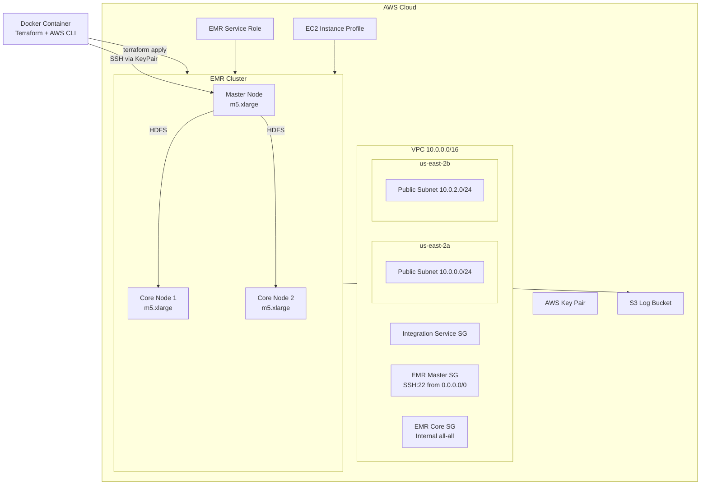
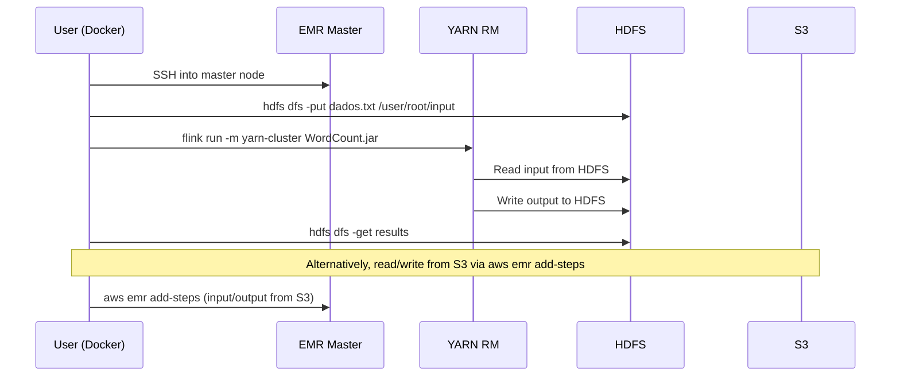

# AWS EMR Flink — Infrastructure as Code

> Provisioning a distributed data processing cluster on AWS EMR with Apache Flink using Terraform.

---

## Overview

This project delivers a fully automated, Infrastructure-as-Code (IaC) deployment of an **AWS EMR cluster** pre-configured with **Apache Flink** for distributed stream and batch processing. The entire infrastructure — networking, IAM roles, security groups, SSH access, and the EMR cluster itself — is defined as Terraform modules and can be provisioned with a single `terraform apply`.

The use case demonstrated is a classic **WordCount** streaming job running on Flink over YARN, reading input from HDFS or S3 and writing results back.

### Problem Solved

Manually provisioning EMR clusters with the correct IAM permissions, network topology, security groups, and Flink configuration is error-prone, time-consuming, and difficult to reproduce. This project solves that by codifying every infrastructure component, making deployments consistent, auditable, and repeatable.

### Key Design Decisions

| Decision | Rationale |
|---|---|
| **Terraform modules** (network, emr, ssh) | Separation of concerns; each layer can be tested and evolved independently |
| **Public subnets only** | Simplified access for development and learning; NAT gateway disabled to reduce cost |
| **`terraform-aws-modules/vpc/aws`** | Community-vetted module reduces boilerplate VPC code |
| **TLS-generated SSH keys** | Keys are created during `terraform apply` and stored locally — no pre-existing key pair dependency |
| **Flink configuration via `jsonencode`** | Native HCL function keeps configuration readable and avoids external template files |
| **Docker-based CLI environment** | Consistent tooling (Terraform 1.15.5 + AWS CLI v2) regardless of host OS |

---

## Architecture



---

## Project Structure

```
.
├── Dockerfile                  # Container with Terraform 1.15.5 + AWS CLI v2
├── .gitignore                  # Ignores Terraform state, plans, generated keys
├── IaC/
│   ├── main.tf                 # Root module — provider, locals, module wiring
│   ├── config.tfvars           # Environment-specific variable values
│   ├── emr/
│   │   ├── emr.tf              # EMR cluster resource definition
│   │   ├── iam.tf              # IAM service role + EC2 instance profile
│   │   ├── security_groups.tf  # Master and core security groups
│   │   └── variables.tf        # Input variables for the EMR module
│   ├── network/
│   │   ├── main.tf             # VPC module + integration security group
│   │   └── constants.tf        # Availability zone mapping
│   ├── ssh/
│   │   └── main.tf             # TLS key pair + AWS key pair generation
│   └── job/
│       └── dados.txt           # Sample text dataset for WordCount job
```

---

## Infrastructure Components

### 1. Network Layer (`network/`)

| Resource | Details |
|---|---|
| **VPC** | `10.0.0.0/16` via `terraform-aws-modules/vpc/aws` |
| **Public Subnets** | `10.0.0.0/24` (us-east-2a), `10.0.2.0/24` (us-east-2b) |
| **DNS** | DNS support and hostnames enabled |
| **NAT Gateway** | Disabled (all traffic through Internet Gateway) |
| **Integration SG** | Placeholder security group for additional service access |

### 2. EMR Layer (`emr/`)

| Resource | Details |
|---|---|
| **EMR Cluster** | Release `emr-7.13.0` with Hadoop, Flink, Zeppelin |
| **Master Node** | 1 × `m5.xlarge` (configurable) |
| **Core Nodes** | 2 × `m5.xlarge` (configurable), 80 GB gp2 EBS each |
| **Flink Configuration** | Parallelism: 2, Task slots: 2, TaskManager memory: 2G, JobManager memory: 1G, Exactly-once checkpointing every 180s |
| **Logging** | EMR logs directed to S3 bucket |

### 3. IAM Layer (`emr/iam.tf`)

| Resource | Purpose |
|---|---|
| `emr_service_role` | Allows EMR to call AWS services on your behalf |
| `emr_profile_role` | Allows EC2 instances in the cluster to access S3, CloudWatch, etc. |
| `emr_ec2_instance_profile` | Instance profile attached to all cluster nodes |

Both roles use AWS-managed policies:
- `AmazonElasticMapReduceRole`
- `AmazonElasticMapReduceforEC2Role`

### 4. Security Groups (`emr/security_groups.tf`)

| Security Group | Inbound | Outbound |
|---|---|---|
| **Master** | SSH (22) from `0.0.0.0/0` | All traffic |
| **Core** | All traffic from within the SG (`self`) | All traffic |

### 5. SSH Access (`ssh/`)

- Generates an **RSA 4096-bit** private key using `tls_private_key`
- Writes private and public keys to `generated/ssh/` (git-ignored)
- Registers the public key as an **AWS Key Pair** for EMR node SSH access

---

## Data Flow



---

## Prerequisites

| Requirement | Version / Notes |
|---|---|
| **Docker** | Any recent version (for containerized workflow) |
| **AWS Account** | With permissions for EMR, EC2, IAM, VPC, S3 |
| **AWS CLI** | Configured with credentials (inside Docker or locally) |
| **S3 Bucket** | Create `aws-emr-flink-<seu-account-id>` before deployment |
| **Terraform** | 1.15.5 (included in Docker image; also usable locally) |

---

## Deployment

### 1. Build the Docker Image

```bash
docker build -t terraform-image:awsflink .
```

### 2. Start the Container

```bash
docker run -dit --name awsflink -v ./IaC:/iac terraform-image:awsflink /bin/bash
```

Then enter the container:

```bash
docker exec -it awsflink /bin/bash
cd /iac
```

### 3. Initialize Terraform

```bash
terraform init
```

### 4. Review and Apply

```bash
terraform plan -var-file config.tfvars -out terraform.tfplan
terraform apply terraform.tfplan
```

### 5. Connect via SSH

```bash
chmod 400 generated/ssh/deployer
ssh -i generated/ssh/deployer hadoop@<master-public-dns>
```

### 6. Run the Flink WordCount Job

```bash
# Inside the master node
hdfs dfs -mkdir /user/root/input
hdfs dfs -put dados.txt /user/root/input
flink run -m yarn-cluster /usr/lib/flink/examples/streaming/WordCount.jar \
  --input hdfs:///user/root/input/dados.txt \
  --output hdfs:///user/root/saida/
```

Alternatively, submit via AWS CLI:

```bash
aws emr add-steps --cluster-id <cluster-id> \
  --steps Type=CUSTOM_JAR,Name=WordCount,Jar=command-runner.jar,\
Args="flink","run","-m","yarn-cluster",\
"/usr/lib/flink/examples/streaming/WordCount.jar",\
"--input","s3://emr-flink-<account-id>/dados.txt",\
"--output","s3://emr-flink-<account-id>/output/"
```

### 7. Destroy

```bash
terraform plan -destroy -var-file config.tfvars -out terraform.tfplan
terraform apply terraform.tfplan
```

---

## Security Considerations

| Aspect | Implementation |
|---|---|
| **IAM Least Privilege** | AWS-managed EMR roles scoped to required services only |
| **SSH Key Management** | 4096-bit RSA keys generated per deployment; private key stored locally and git-ignored |
| **Security Groups** | Master node exposes only SSH; core nodes restricted to internal cluster communication |
| **Network Isolation** | All resources deployed inside a dedicated VPC |
| **Logging** | EMR logs shipped to S3 for audit trails |
| **State File Security** | Terraform state stored locally (not in remote backend) — **consider migrating to S3 + DynamoDB for production** |

> **Warning:** The master security group allows SSH from `0.0.0.0/0`. For production, restrict this to your IP range or use AWS Systems Manager Session Manager.

---

## Monitoring and Logging

**Currently not implemented.** The EMR cluster emits logs to the configured S3 bucket (`s3://aws-emr-flink-<seu-account-id>`), but no CloudWatch dashboards, metrics alarms, or log groups are provisioned by this IaC. This is a deliberate scope limitation for a learning/demonstration project.

---

## Scalability

| Feature | Status |
|---|---|
| **Resize core nodes** | Manual — change `emr_core_instance_count` in `config.tfvars` and re-apply |
| **Auto Scaling** | Not implemented |
| **Multi-master HA** | Not supported in this configuration (single master node) |

---

## Future Improvements

- [ ] Add **S3 backend + DynamoDB lock** for remote Terraform state
- [ ] Implement **EMR auto-scaling** rules based on YARN metrics
- [ ] Add **CloudWatch alarms** for cluster health and job failures
- [ ] Restrict SSH access to a specific CIDR range
- [ ] Enable **Kerberos authentication** using existing `kerberos_attributes` block
- [ ] Add **bootstrap actions** for custom cluster setup using existing `bootstrap_action` block
- [ ] Create the S3 log/data bucket via Terraform instead of manually
- [ ] Add **variable validation** blocks for instance types and release labels
- [ ] Add **CI/CD pipeline** (GitHub Actions) for plan-on-PR, apply-on-merge
- [ ] Implement **VPC endpoints** for S3 and DynamoDB to avoid public internet routing

---

## Lessons Learned

1. **Module granularity matters.** Separating network, EMR, and SSH into individual modules made each layer independently testable and reusable.

2. **Terraform community modules save time.** The `terraform-aws-modules/vpc/aws` module reduced ~100 lines of VPC boilerplate to a single block.

3. **JSON-encoding HCL values** via `jsonencode()` is a clean pattern for passing complex configurations (like Flink settings) to AWS resources without external template files.

4. **Variable typing prevents bugs.** The `steps` variable uses a fully-typed `list(object(...))` definition, which catches misconfigurations at plan time rather than apply time.

5. **Docker guarantees reproducibility.** Packaging Terraform and AWS CLI versions in a container eliminates "works on my machine" issues across different host environments.

6. **Security group syntax is strict.** Terraform requires block syntax (`ingress { }`) for inline rules — attribute syntax (`ingress = { }`) silently fails validation. Always validate with `terraform validate` before applying.

---

## License

This project is part of a Data Engineering portfolio and is shared for educational purposes.
